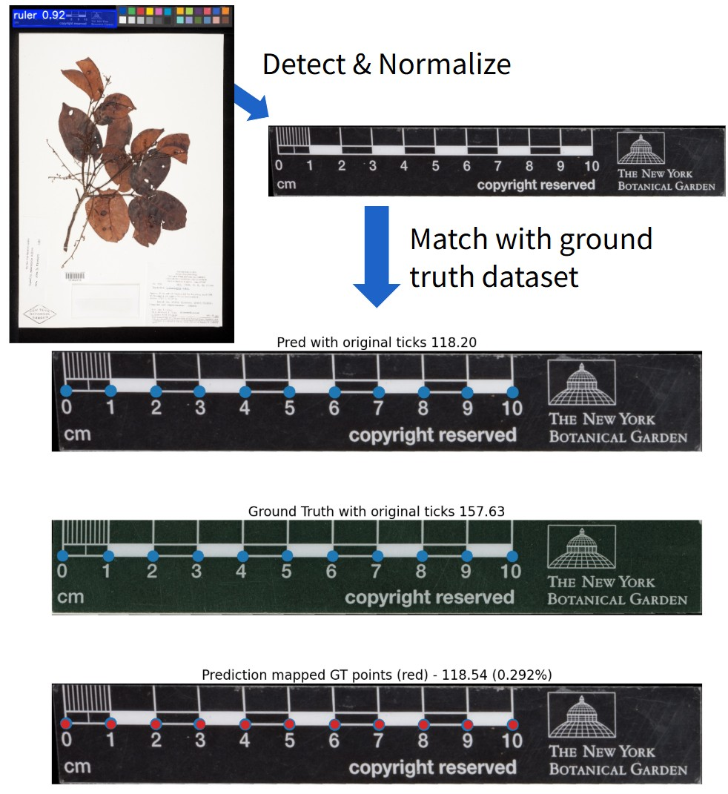

## Herbarium Ruler Detection & Matching

    
### Web demo & API coming soon  
Will be published at: [herbaria.idlab.ugent.be](https://herbaria.idlab.ugent.be/)

### Sample code  
You can use [this Colab notebook](https://colab.research.google.com/drive/1_cTuyreBo09ceAn3kVCTAxTWEgAEIUi2?usp=sharing) to run both the ruler detection and matching models on a sample image or other dataset.
  
### Ruler Dataset

The dataset contains 492 rulers from 400 herbarium sheets from over 40 institutions, taken randomly from GBIF, [PlantCLEF2020](https://www.imageclef.org/PlantCLEF2020), and from [Dillen et al.](https://pmc.ncbi.nlm.nih.gov/articles/PMC6396854/). Each ruler is annotated with its bounding polygon and tick mark locations.

- The cropped and normalized ruler images and tick mark annotations can be downloaded [here](https://cloud.ilabt.imec.be/index.php/s/8yQYcoq2LGLM64b) as well as the fine-tuned YOLOv11-nano segmentation model and CLIP embeddings of our dataset
- The original herbarium sheets and original annotations of each ruler (in [LabelMe](https://github.com/wkentaro/labelme) format) can be downloaded [here](https://cloud.ilabt.imec.be/index.php/s/G6wW6gt3D9wkWR7)

Each ruler is annotated as follows:

```python
{
    "label": "ruler_kodak_partial", # Type of the ruler
    "shape_type": "Polygon", # Type of the shape annotation
    "orig_points": [ # => Coordinates wrt original image
        [x1,y1],
        [x2,y2],
        ...
        [xn,yn]
    ],
    "normalized_points": [  # => Coordinates wrt cropped ruler image
        [x1,y1],
        [x2,y2],
        ...
        [xn,yn]
    ],
    # Annotation for the labels on the ruler
    "tick_labels": [
        {
            "shape_type": "LineString", 
            "label": "ticks_1cm",
            "orig_points": [ # => Coordinates wrt original image
                [x1,y1],
                [x2,y2],
                ...
                [xn,yn]
            ],
            "normalized_points": [ # => Coordinates wrt cropped ruler image
                [x1,y1],
                [x2,y2],
                ...
                [xn,yn]
            ]
        },
        # Annotation for the second tick label on the same ruler
        {
            "shape_type": "LineString",
            "label": "ticks_1inch",
            "orig_points": [....]
            "normalized_points": [....]
        }
    ]
}
```


### Contact & Collaboration

We actively encourage collaboration with researchers and developers interested in:  
- Extending the dataset (new ruler types or annotations)  
- Benchmarking new models or algorithms  
- Integrating the methods or dataset into larger-scale projects

Feel free to reach out to: kenzo.milleville@ugent.be

### Citing this dataset

**Will be updated upon publication**
